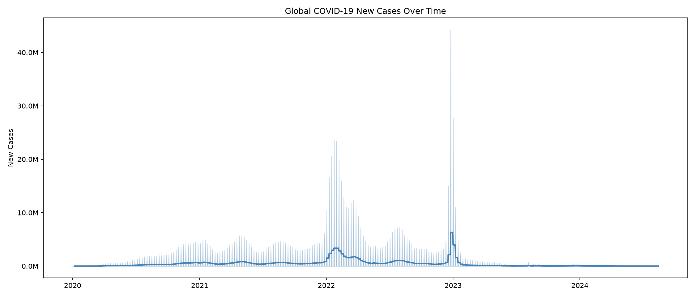
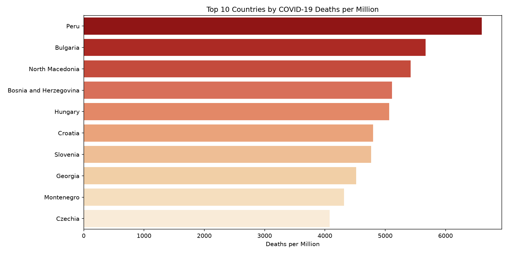
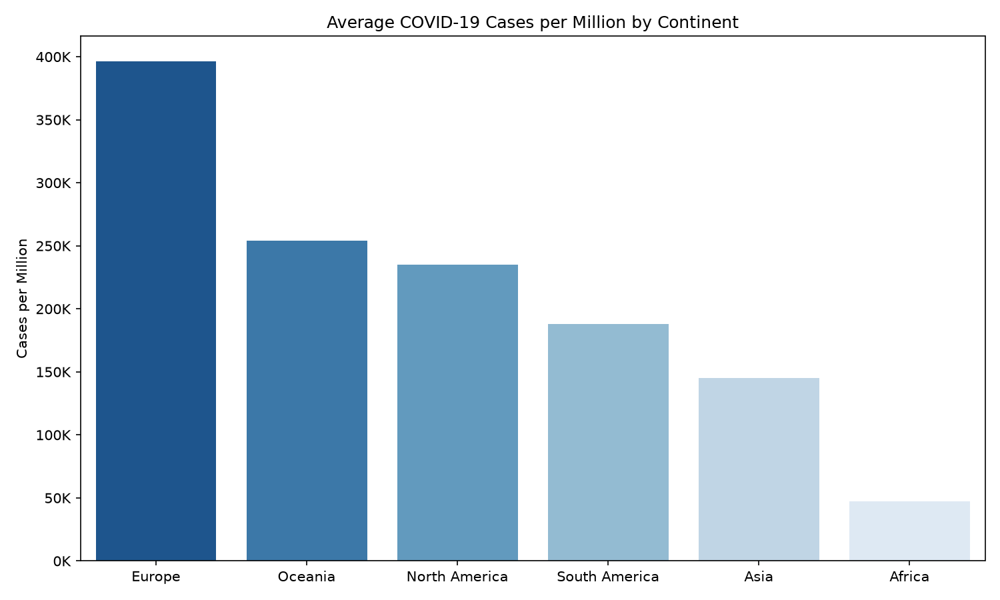

# COVID-19 Data Analysis

End-to-end exploratory analysis of the Our World in Data COVID-19 dataset covering 243 countries from January 2020 to August 2024. The dataset contains 67 variables across 400,000+ rows including cases, deaths, vaccinations, hospitalizations and socioeconomic indicators.

**Live interactive chart:** https://olarewajumary.github.io/covid-analysis/

## What this project covers

- 10 visualizations exploring global trends, regional comparisons and relationships between variables
- SQL pipeline using SQLite to query the data before analysis
- Published as an interactive notebook on Kaggle

## A few of the visualizations





## Key findings

- The US recorded the highest total cases but deaths per million told a completely different story, Peru and Eastern European countries led that metric
- The Omicron wave in late 2021 and early 2022 dwarfed every previous wave in case volume
- A data anomaly in early 2023 revealed China mass-reporting cases after ending their zero-COVID policy
- Wealthier countries generally vaccinated more of their population but low income countries showed surprising variation
- Europe fell below Africa in average vaccination rates, driven by vaccine hesitancy in Eastern Europe rather than supply issues
- Median age was a strong predictor of death rate at the national level
- Africa's low recorded case numbers almost certainly reflect limited testing capacity rather than genuinely lower infection rates

## Tech stack

- Python
- Pandas
- Matplotlib
- Seaborn
- Plotly
- SQLite

## Project structure
```
covid-analysis/
├── main.py           # runs the full pipeline: clean, visualize, build DB, query
├── src/
│   ├── explore.py     # loading and cleaning
│   ├── visualize.py    # all 10 charts, static and interactive
│   └── database.py     # SQLite database creation and querying
├── docs/              # live interactive chart, hosted via GitHub Pages
└── data/              # dataset (not tracked in Git, see below)
```

## Running it yourself

```
git clone https://github.com/olarewajumary/covid-analysis
cd covid-analysis
python -m venv venv
venv\Scripts\activate
pip install -r requirements.txt
curl -L -o data/owid-covid-data.csv https://raw.githubusercontent.com/owid/covid-19-data/master/public/data/owid-covid-data.csv
python main.py
```

## Data Source
Our World in Data COVID-19 dataset, aggregated from WHO, government health ministries and the European CDC.
Available at: https://github.com/owid/covid-19-data

## Kaggle Notebook
Full interactive notebook published on Kaggle:
https://www.kaggle.com/code/maryolarewaju/covid-19-global-data-analysis-eda-sql-pipeline